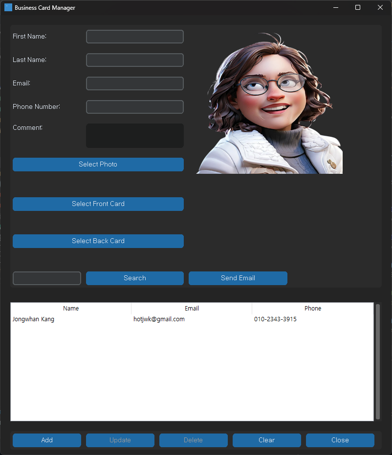

# 🧾 NewBusCard

A lightweight, modern **Business Card Manager** built with Python and **CustomTkinter** — perfect for managing professional contacts with a sleek interface.

---

## 📸 Screenshot

## 

## ✨ Features

- 📇 Add, view, edit, and delete business card entries
- 🖼️ Store names, phone numbers, emails, and photos
- 🖌️ Beautiful CustomTkinter-based GUI
- 🔐 Environment config via `.env` using `python-decouple`
- 🛢️ Local SQLite database support

---

## 🚀 Installation

Install from PyPI:

```bash
pip install newbuscard

```
